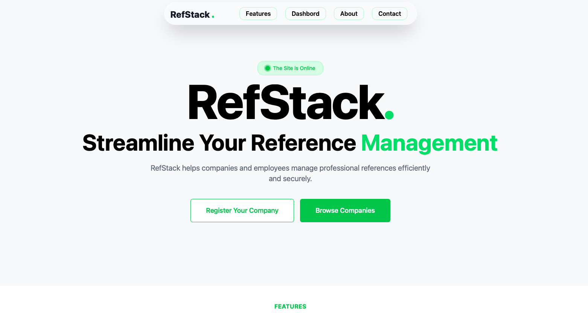
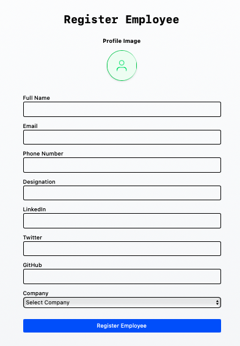
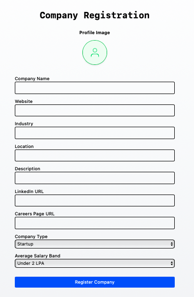

# 🏢 Employee & Company Registry Application

A full-stack registry application to manage **employees** and **companies** in one place.  
The system allows storing detailed employee information (LinkedIn, GitHub, Email, etc.) as well as company details (social media links, career page, etc.).

---

## ✨ Features

### 👨‍💼 Employee Module
- Register and manage employees
- Store personal & professional details
- Save LinkedIn, GitHub, Email, and other profiles
- Organized company-wise

### 🏢 Company Module
- Register and manage companies
- Store official details, social media links, and career page
- Company-wise employee association

---

## 📸 Screenshots

### 🏠 Home Page


### 👨‍💼 Employee Registration


### 🏢 Company Registration


---

## 🛠️ Tech Stack
- **Frontend:** React + Tailwind CSS
- **Backend:** Node.js / Express
- **Database:** MongoDB (or your chosen DB)
- **Styling:** Tailwind + Custom CSS
- **Deployment:** (fill in if deployed)

---

## 🚀 Getting Started

### 1️⃣ Clone the repository
```bash
git clone https://github.com/yourusername/registry-app.git
cd registry-app
